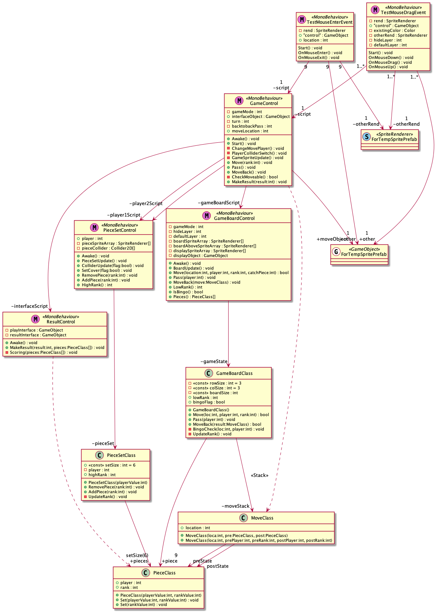

university_gameprogramming
============================
   
유니티 기반 TicTacToe 변형 게임   
   
게임프로그래밍 강의 기말과제를 위해 만들었던 게임   
   
게임 로직을 간단하게 하고 짧은 개발 기간 내로 특별한 외부 프레임워크 없이 동작하게 하고싶어서 TicTacToe 기반의 게임을 주제로 정했다.   
가능한 단일책임의 원칙을 최대한 적용한 구조를 만들어보고 싶었다.  
   
## PieceClass
> 게임의 기본 단위가 되는 말   
   
## MoveClass   
> 말의 움직임의 단위   
> 누가 어떤 말을 어떻게 움직였는지 저장하기 위해 만들었다   
> 이전 상태와 이후 상태의 표시 가능   
   
## GameBoardClass   
> 게임이 이루어지는 게임 판   
> Move(말이 놓인 것), Pass(턴을 넘긴 것), MoveBack(무르기) 동작만 처리   
> Move, Pass 시 MoveClass 스택에 넣어서 이전상태로 되돌리기 가능   
> tictactoe가 완성 됐는지 확인하는 기능 또한 존재   
   
## GameBoardControl   
> GameBoardClass를 동작시키고 관련 sprite를 처리하기 위한 클래스   
> GameBoardClass의 정보를 바꾸고 싶다면 반드시 이 클래스의 메소드를 호출할 것    
   
## PieceSetClass   
> 각 플레이어의 말의 모음   
   
## PieceSetControl   
> PieceSetClass를 동작시키고 관련 sprite를 처리하기 위한 클래스   
> PieceSetClass의 정보를 바꾸고 싶다면 반드시 이 클래스의 메소드를 호출할 것    
   
## GameControl   
> 게임 한판의 총괄   
> 외부에서 게임을 조작하고 싶다면 반드시 이 클래스의 메소드를 호출할 것   
> 게임에 대한 룰 또한 이곳에서 판정   
> 클라이언트의 경우 UI를 통한 동작, 서버에 올린다면 네트워크로 사용자가 원하는 동작을 이 클래스의 메소드에 연결하여 처리   
   
상술한 클래스들의 일부 함수만 수정하면(주로 초기화) 클라이언트에서도 서버에서도 동작할 수 있는 것을 목표로 설계했다.   
   
## \*Event   
> 게임에서 사용자가 하는 동작에 대한 처리   
   
   
이하 게임의 가장 중요한 클래스들을 모아둔 UML   
   
